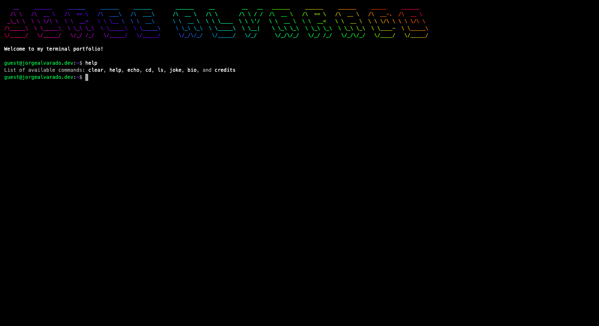

# Terminal-based Portfolio

## Demo

[Have a look!](https://alvarado08.github.io/terminal-portfolio/ "Jorge Alvarado's Terminal-based Portfolio")

## Motivation

Simply a fun and attractive looking project for the weekend!

## Description

Everything you expect a personal portfolio to have but terminal flavored.

Has autocomplete(tab) and default commands for navigation and interactions.

### Tech stack

### Sections/Directories

- contact
- education
- projects
- skills

### Commands

- help
- clear
- echo
- cd
- ls
- joke
- bio
- credits

## Acknowledgements

Huge thank you to [freeCodeCamp](https://www.freecodecamp.org/ "freeCodeCamp Offcial Site") and [Jakub Jankiewicz](https://jakub.jankiewicz.org/ "Jakub Jankiewicz Portfolio") for the amazing material.
